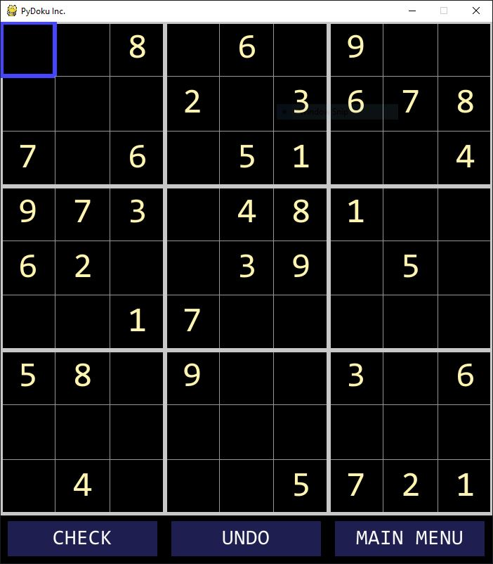

# PyDoku Inc. #

A GUI implementation of the age old game of Sudoku.

# Table of Contents #

* [Dependencies](#dependencies)
* [Installation](#installation)
* [Documentation](#documentation)
* [Extending The Game](#extending-the-game)
* [Licensing](#licensing)
* [Addendums](#addendums)

# Dependencies: #

- Python 3.6.1 or above
- PyGame 1.9.4 or above

# Installation: #

1. Install Python from [here](https://www.python.org/). You can skip this step if you have Python 3.6.1 or above already installed.

2. Install PyGame using this [guide](https://www.pygame.org/wiki/GettingStarted). You can skip this step if you already have PyGame 1.9.4 or above already installed.

3. Click on the  button

4. Cick on "Download ZIP"

5. Extract ZIP folder to some directory in the computer

6. Navigate to the src folder, then run sudoku_gui.py

When you run the game, you will be greeted with this window (Note that you may not get the same Sudoku puzzle):

  

### How To Play ###

* Use Arrow Keys/WASD to move the selected box around the board, or use the mouse to select a box.
* Use the Number Keys to place a number in the selected box (pressing "0" will clear the entry in that box)
* Click the "CHECK" button to check if the puzzle has been solved.
* Click the "UNDO" button if you wish to undo a move.

# Documentation: #

### Directory Structure: ###

    ├── readme_resources        # The resources loaded in the README (e.g. the game screenshot)
    ├── src                     # The source code for the game
    │   ├── dataset             # The Sudoku boards in text file format that will be loaded by the game
    |   |   ├── debug           # The Sudoku boards in text file format that can be used for debugging
    ├── test                    # The testing scripts that can be used to test parts of the project
    ├── LICENSE
    └── README.md          
    
### Code Documentation: ### 

#### `SudokuGUI` ####
TODO: Sharven

#### `SudokuBoard` ####
TODO: Yaman

#### `Menu` ####
TODO: Aditya

#### `SettingsMenu` ####
TODO: Greg

# Extending The Game: #

TODO: Greg

# Licensing: #

MIT License (Public Domain)

Copyright (c) 2019 PyDoku Inc. (Greg Zetko, Sharven Prasad Dhanasekar, Aditya Arora, Yaman Abouyouniss)

Permission is hereby granted, free of charge, to any person obtaining a copy
of this software and associated documentation files (the "Software"), to deal
in the Software without restriction, including without limitation the rights
to use, copy, modify, merge, publish, distribute, sublicense, and/or sell
copies of the Software, and to permit persons to whom the Software is
furnished to do so, subject to the following conditions:

The above copyright notice and this permission notice shall be included in all
copies or substantial portions of the Software.

THE SOFTWARE IS PROVIDED "AS IS", WITHOUT WARRANTY OF ANY KIND, EXPRESS OR
IMPLIED, INCLUDING BUT NOT LIMITED TO THE WARRANTIES OF MERCHANTABILITY,
FITNESS FOR A PARTICULAR PURPOSE AND NONINFRINGEMENT. IN NO EVENT SHALL THE
AUTHORS OR COPYRIGHT HOLDERS BE LIABLE FOR ANY CLAIM, DAMAGES OR OTHER
LIABILITY, WHETHER IN AN ACTION OF CONTRACT, TORT OR OTHERWISE, ARISING FROM,
OUT OF OR IN CONNECTION WITH THE SOFTWARE OR THE USE OR OTHER DEALINGS IN THE
SOFTWARE.

# Addendums: #

### Yaman Abouyouniss: ###

For this project, I worked on the backend components of the code. I spent much of my time attempting to create a completely random board generator. However it was too buggy to use in the master branch of the code so I chose another strategy for board generation. I collected free online sudokuboards and placed this dataset into the project folder. This consisted of creating a 2D list using one of the .txt files in the board. I also created a random string generator which chooses a random board from the dataset to use as the gameboard. Lastly, I created the method which checks if the win condition has been reached. My contribution to the README file was that I wrote the installation guide.

### Aditya Arora: ###

For this project, I worked on the frontend/visual components of the code (specifically, the main menu). I spent my time creating the main menu and integrating the buttons to work together when launching the application. Unfortunately, due to time purposes our team has decided to keep the main menu separate from the game itself and let other users who want to contribute to our game take over and integrate it themselves (consider it a challenge). I also helped the team schedule meetings and supported my other team members when they needed help during the project. 

### Sharven Prasad Dhanasekar: ###

For this project, I programmed the GUI application. More specifically, I coded the `SudokuGUI` class which handles the rendering of the Sudoku board, the user input, and the in game buttons. Moreover, I also integrated the backend components, such as the `SudokuBoard` class, with the GUI application so that the GUI properly updates and recieves information from the backend. My contributions to the README is that I added the formatting to it (e.g. the headings, table of contents, links, etc.). Apart from the formatting, I added the Licensing information to the README, the directory structure, the documentation for the `SudokuGUI` class, and the instructions on how to play the game using the controls.

### Greg Zetko: ###

TODO: Greg